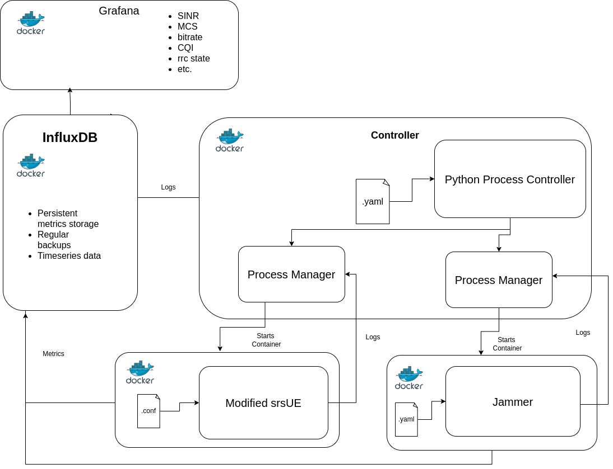

NTIA RAN Tester UE
==================

Penetration testing tool for 5G and O-RAN security vulnerabilities using software-defined radio UE emulation.

Overview
--------

This project is a security testing tool based on srsRAN Project's User Equipment, used to test 5G and open radio access networks (O-RAN) via the Uu air interface between the UE and the network. While this enables different types of testing, the focus of the software is on RAN security testing. This Soft T-UE is a fully software-defined and compatible with widely available, commercial-off-the-shelf hardware. 

The key to this testing equipment is providing key performance indicators of the RAN once under attack such as:

.. toctree::
   :maxdepth: 1
   :caption: Metrics

   Grafana <rstFiles/grafana_metrics>
   srsUE Metrics <rstFiles/metrics_documentation>

Testing Capabilities
---------------------

Standardized 3GPP or O-RAN tests as well as custom test procedures can then be implemented and executed at minimal cost and at different stages of RAN development and integration. This system allows for testing many commercial and open source random access networks with minimal technical overhead. Many attacks on the RAN can be run automatically by the system.
The available attacks are:

.. toctree::
   :maxdepth: 1
   :caption: Attacks

   Jamming <attacks/jamming_attack>
   Fuzzing <attacks/fuzzing_attack>
   Flooding <attacks/flooding_attack>

System Architecture
--------------------

The main components of the system architecture are the controller, the GUI (Grafana), ...

.. toctree::
   :maxdepth: 1
   :caption: Metrics

   Grafana <rstFiles/grafana_metrics>
   srsUE Metrics <rstFiles/metrics_documentation>

Datasets
---------

To get started using the Soft T-UE please follow the documentation below.

.. toctree::
   :maxdepth: 1
   :caption: Getting Started

   Quickstart <rstFiles/quickstart>
   Installation <rstFiles/installation>
   Configuration <rstFiles/configuration>
   Routing Traffic <rstFiles/ip_routing>

.. toctree::
   :maxdepth: 1
   :caption: For Developers

   Development Overview <rstFiles/development>
   Message Types <rstFiles/message_types>
   Monitor Thread API <rstFiles/controller_api_guide>
