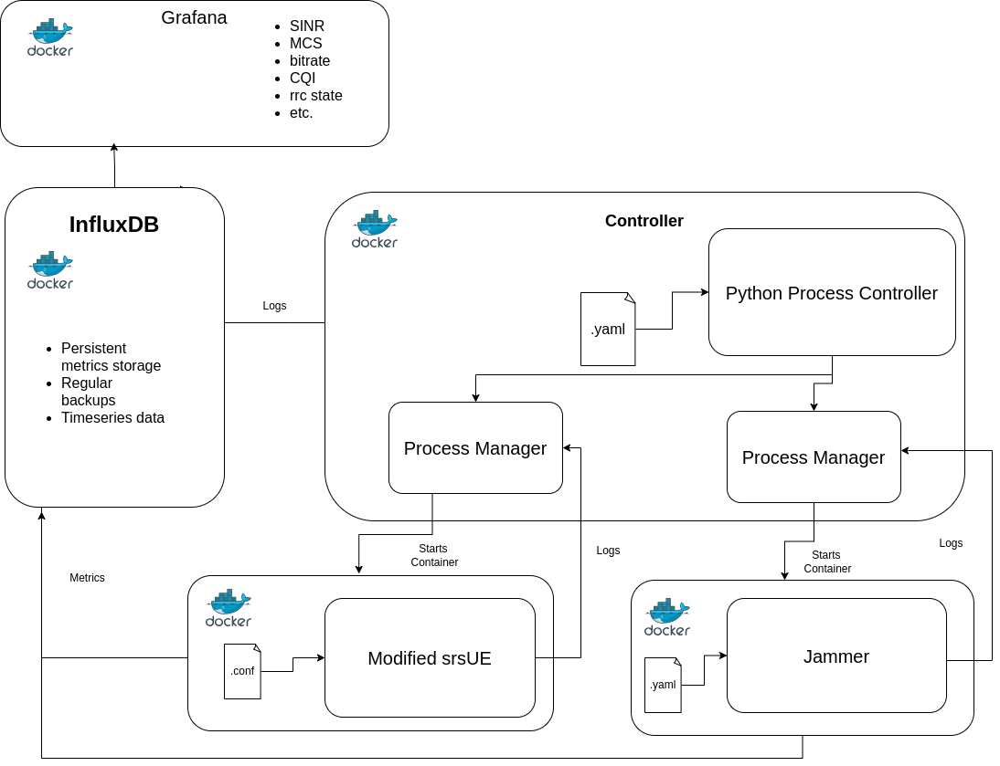

System Architecture
===================

The main components of the system architecture are the controller, the GUI (Grafana), InfluxDB, Controller, Jammer, and modified srsUE.

.. toctree::
   :maxdepth: 1
   :caption: Architecture

   Overview <../rstFiles/components>
   Container Jobs <../rstFiles/container_jobs>