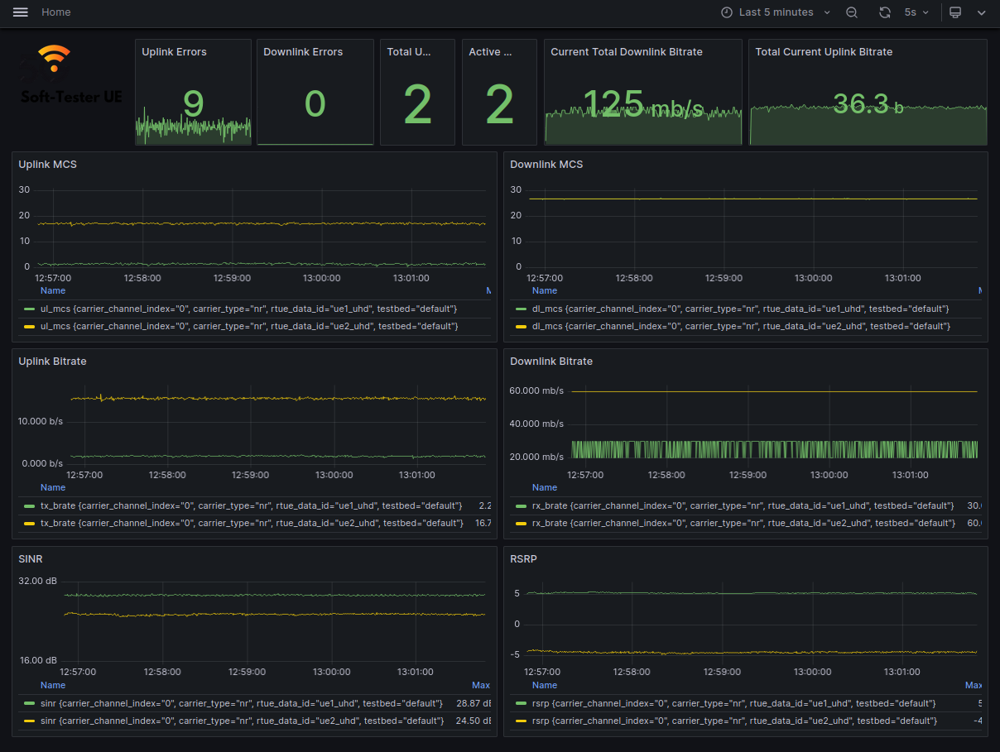

Metrics from Grafana
====================

Current Metrics
----------------

The metrics that are currently displayed using Grafana are:

-  :bold-point:`rsrp`: Reference Signal Received Power (RSRP). Measures the
   power level of the reference signal.
-  :bold-point:`ul_mcs`: Uplink modulation and coding scheme (MCS).
-  :bold-point:`dl_mcs`: Downlink modulation and coding scheme (MCS).
-  :bold-point:`sinr`: Signal-to-Interference-plus-Noise Ratio (SINR).
   Represents the quality of the signal.
-  :bold-point:`rx_brate`: Received bitrate in Kbps. Computed as the average
   bitrate over the number of TTI (Transmission Time Intervals).
-  :bold-point:`tx_brate`: Transmitted bitrate in Kbps. Computed as the
   average bitrate over the number of TTIs.
-  :bold-point:`rx_errors`: Total number of receive errors.
-  :bold-point:`tx_errors`: Total number of transmit errors.
-  :bold-point:`active_ues`: Total number of UEs connected to the RAN.
-  :bold-point:`total_ues`: Total number of UEs transmitting metrics to InfluxDB.

Additionally, the total downlink and uplink bitrates of all UEs on the system are displayed.

What you should see
-------------------

Go to `http://localhost:3300` and you should see the following:

